

# ⌛ FutureCast
[FutureCast](https://futureforecast.netlify.app/) is a decentralized market where users can stake on a question and get exciting and high returns. We can provide you more returns with the help of external network staking clients. What are you waiting for? Lets stake some Matic with minimal gas fee!🥳

## ✨ Our Stack
* **React**
* **SASS** for styling
* **Web3** for connecting to Blockchain
* **Matic** for deploying our [Smart Contracts](https://github.com/codeDcode-2021/futurecast-contracts)
* **Nelify** for Continous Deployment

*Currently, we support Portis and MetaMask as Wallet options*
 
 ## ✨Get FutureCast client up and running locally ASAP
 * `git clone` the repository.
 * `cd` to the repository directory.
 * Make sure you have [Node and NPM installed](https://nodejs.org/en/download/) or Yarn instead of NPM, according to your preference.
 * Use `npm install` or `yarn` command to install the dependencies.
 * Open the project in your favorite IDE. We ❤ VS Code.
 * Use `npm start` or `yarn start` command to start the development server.

Yes, it's that simple! 😆

## ✨ Contributions
* Feel free to create an issue if you find any bugs or if you would like to see a new feature. We request you to be specific with the issue, steps to reproduce are appreciated with expected behavior.
* If you find any bugs and want to contribute to the project, feel free to clone the repo and create a pull request!

## ✨Screenshots

  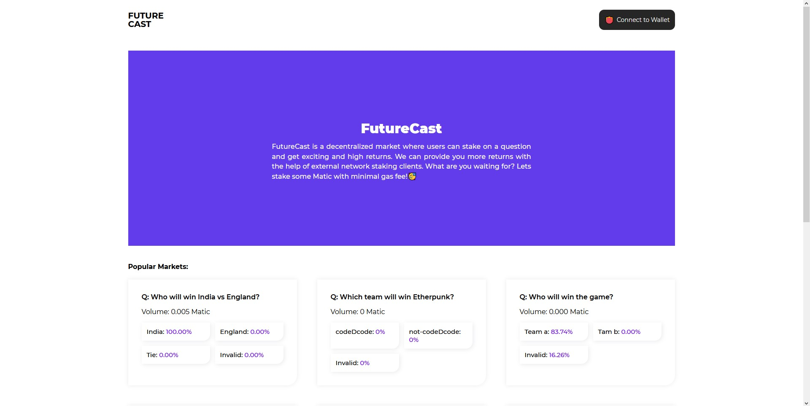
  
Landing Page 

  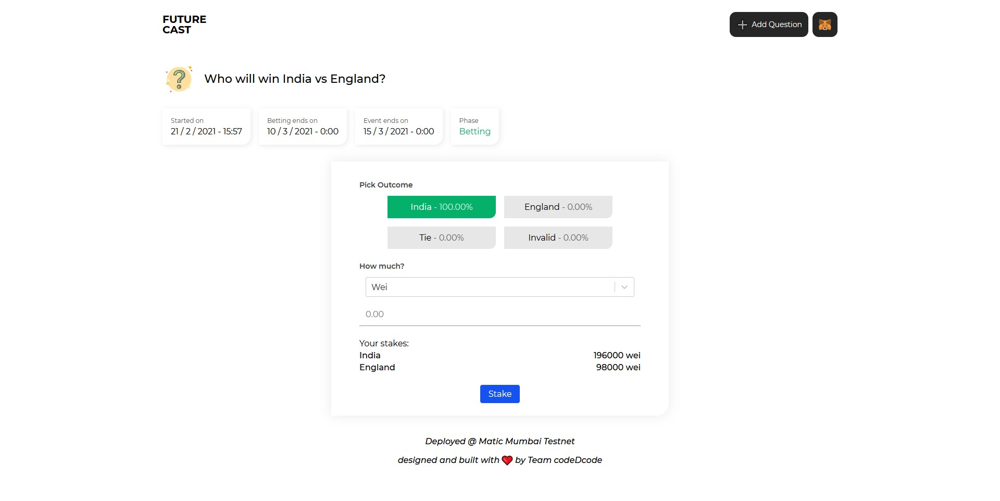
  
Market Page 

  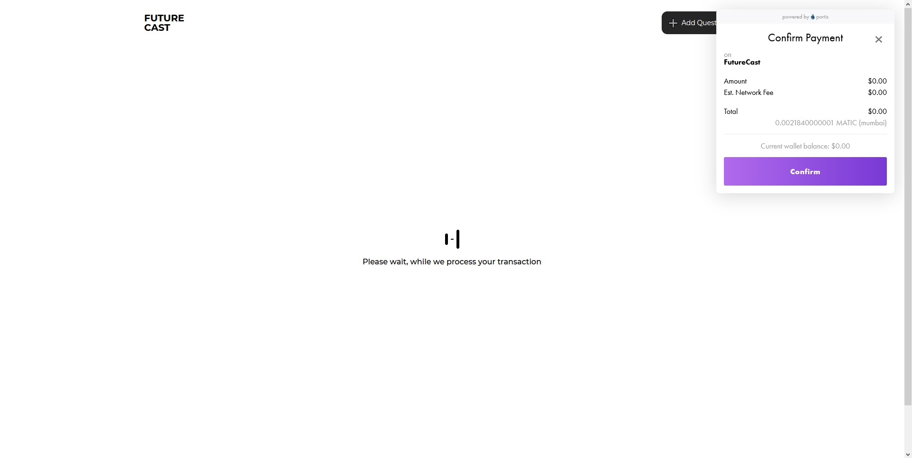
  
Process Transaction Page

  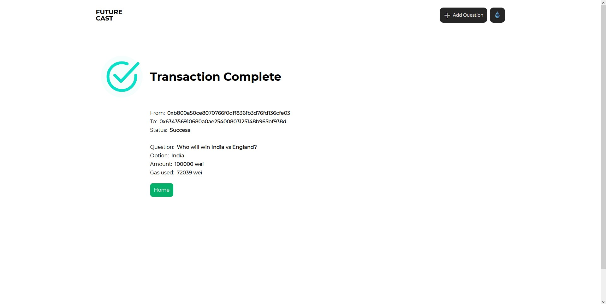
  
Transaction Complete Page

  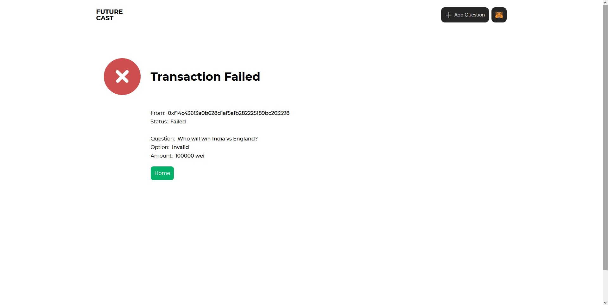
  
Transaction Failed Page

  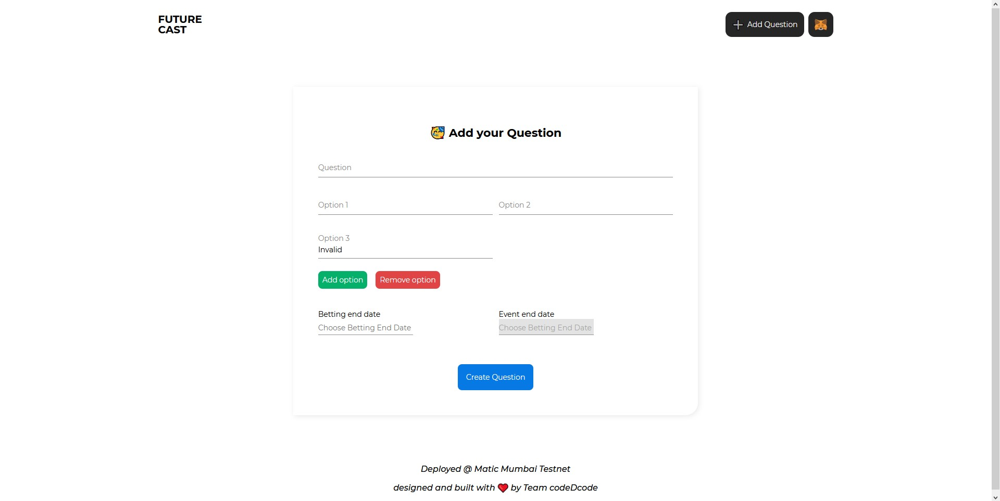
  
New Question Page

  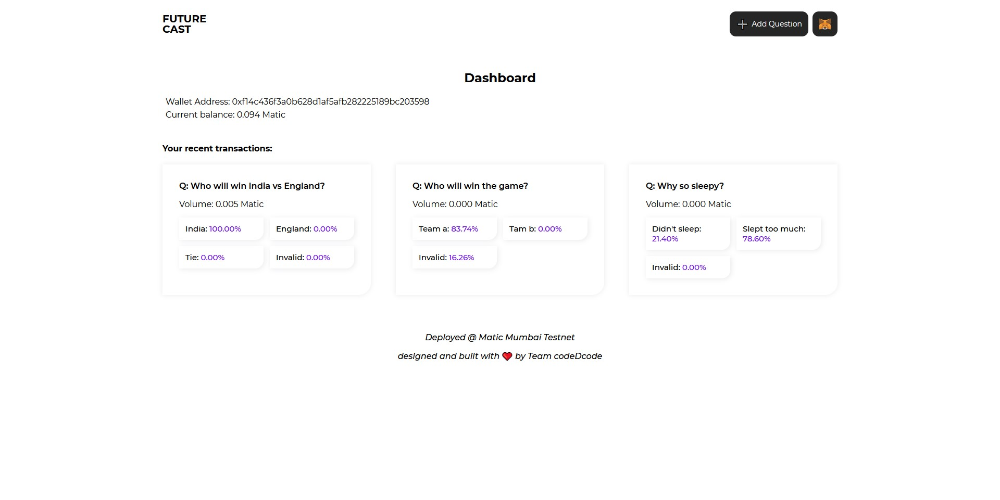
  
Dashboard Page

  

    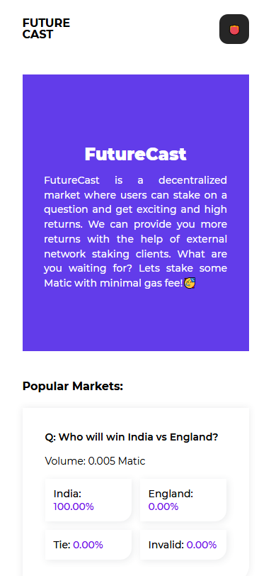
    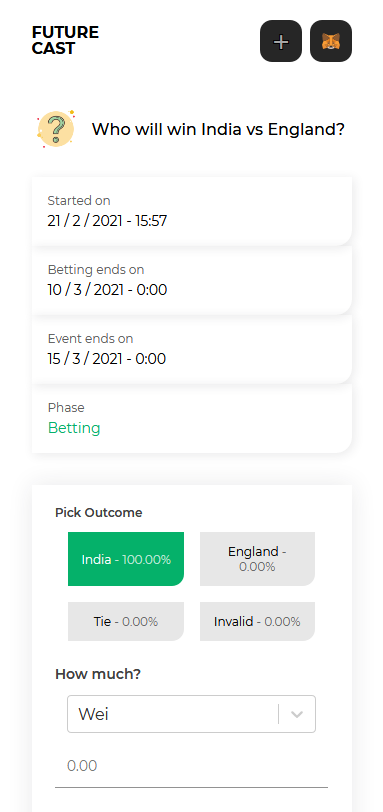
    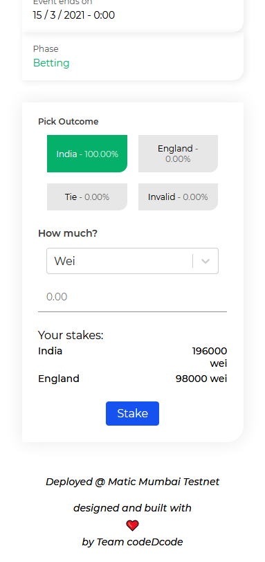
  

  

    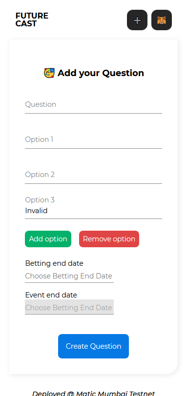
    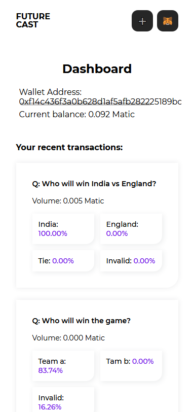
  

  
Mobile View

 

 
 ## ✨ Our Team
<table>
  <tr>
    <td align="center">
      <a href="https://github.com/akcgjc007">
          
           
          <b>Anupam Kumar</b>
      </a>
    </td>
    <td align="center">
      <a href="https://github.com/rashtrakoff">
          
           
          <b>Chinmay Sai Vemuri</b>
      </a>
    </td>
    <td align="center">
      <a href="https://github.com/sksuryan">
          
           
          <b>Saurabh Kumar Suryan</b>
      </a>
    </td>
    <td align="center">
      <a href="https://github.com/CapTen101">
          
           
          <b>Tushar Rohilla</b>
      </a>
    </td>
    <td align="center">
      <a href="https://github.com/VipinVIP">
          
           
          <b>VIPIN K P</b>
      </a>
    </td>
  </tr>
</table>

*handcrafted and designed with ❤ by team codeDcode*
